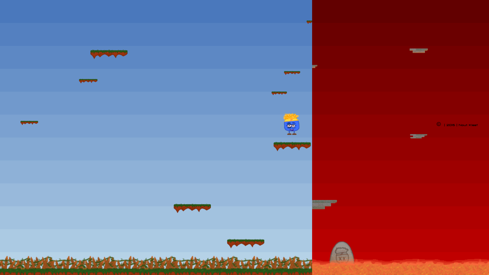

# blue-jump
I made this game back in 2016 to feature on my Informatics (high school subject) [website](http://nkleef.informatica.bc-enschede.nl).

Back then, I was not using Git yet. Fast forward to 2019, I decided to port this project over to GitHub, because I had a lot of fun making the sprites for the game, and it looks a lot more colorful than the projects I work on nowadays... :man_technologist:

*(I morphed the two game modes into one image to feature on my new website [kleef.tech](https://kleef.tech). This is not what the game actually looks like.)*

## usage
1) `sudo npm install`
2) `gulp`
3) `cd dist/`
4) `python3 -m http.server`
5) go to `http://localhost:8000`
